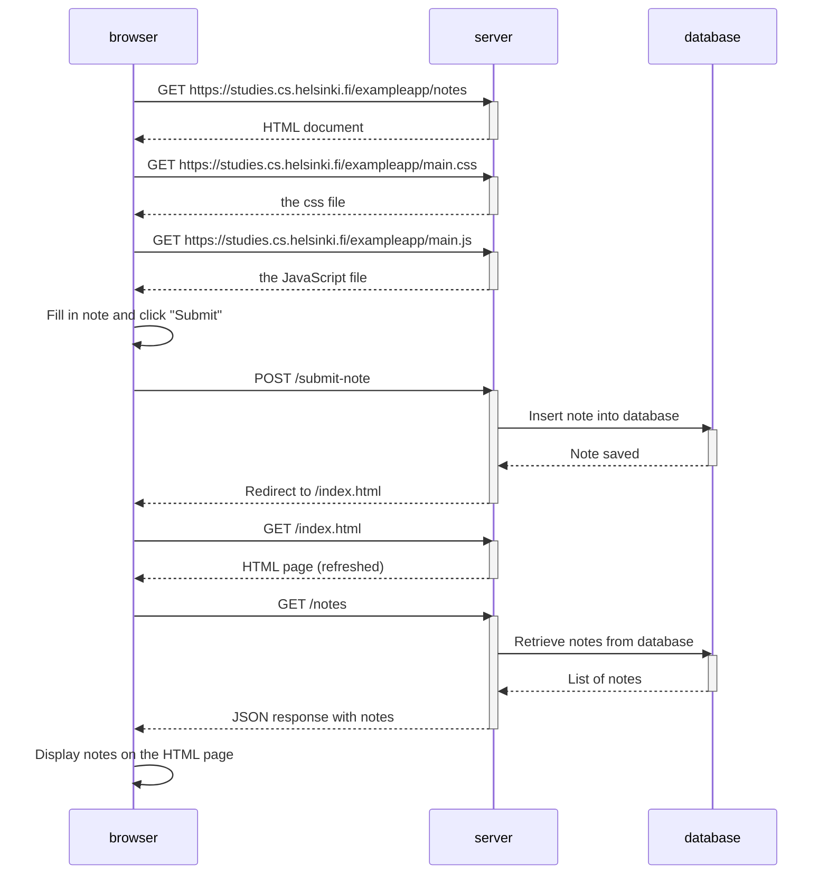

```mermaid
sequenceDiagram
    participant browser
    participant server

    browser->>server: GET https://studies.cs.helsinki.fi/exampleapp/notes;
    activate server;
    server-->>browser: HTML document;
    deactivate server;

    browser->>server: GET https://studies.cs.helsinki.fi/exampleapp/main.css;
    activate server;
    server-->>browser: the css file;
    deactivate server;

    browser->>server: GET https://studies.cs.helsinki.fi/exampleapp/main.js;
    activate server;
    server-->>browser: the JavaScript file;
    deactivate server;

    browser->>browser: Fill in note and click "Submit"

    browser->>server: POST /submit-note
    activate server
    server->>database: Insert note into database
    activate database
    database-->>server: Note saved
    deactivate database
    server-->>browser: Redirect to /index.html
    deactivate server

    browser->>server: GET /index.html
    activate server
    server-->>browser: HTML page (refreshed)
    deactivate server

    browser->>server: GET /notes
    activate server
    server->>database: Retrieve notes from database
    activate database
    database-->>server: List of notes
    deactivate database
    server-->>browser: JSON response with notes
    deactivate server

    browser->>browser: Display notes on the HTML page

```