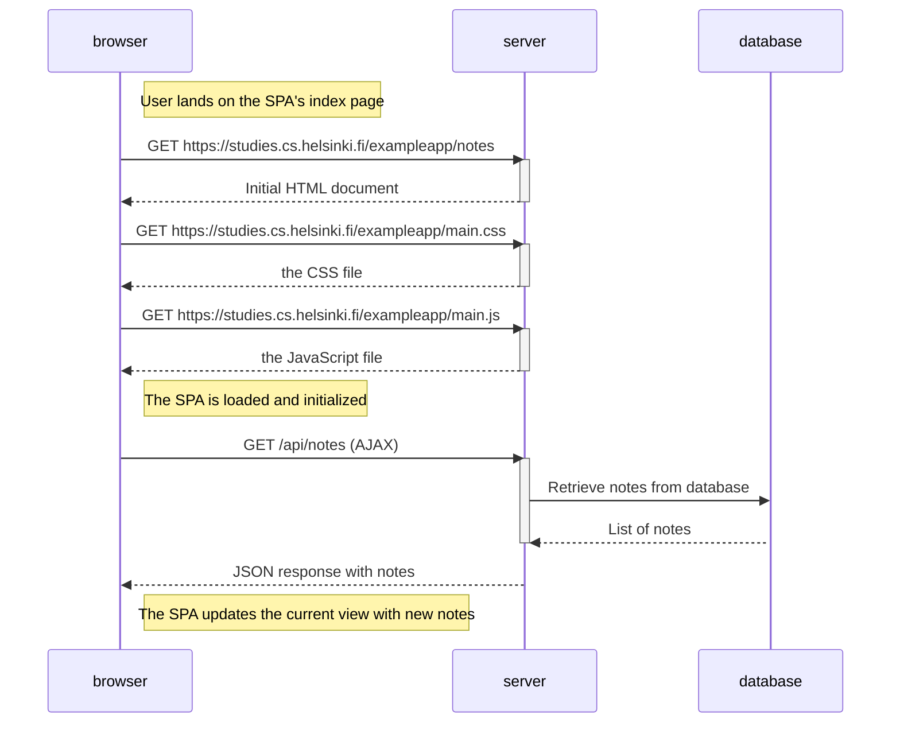

```mermaid
sequenceDiagram
    participant browser
    participant server

    Note right of browser: User lands on the SPA's index page

    browser->>server: GET https://studies.cs.helsinki.fi/exampleapp/notes;
    activate server;
    server-->>browser: Initial HTML document;
    deactivate server;

    browser->>server: GET https://studies.cs.helsinki.fi/exampleapp/main.css;
    activate server;
    server-->>browser: the CSS file;
    deactivate server;

    browser->>server: GET https://studies.cs.helsinki.fi/exampleapp/main.js;
    activate server;
    server-->>browser: the JavaScript file;
    deactivate server;

    Note right of browser: The SPA is loaded and initialized

    browser->>server: GET /api/notes (AJAX)
    activate server;
    server->>database: Retrieve notes from database
    activate database
    database-->>server: List of notes
    deactivate server
    server-->>browser: JSON response with notes
    
    Note right of browser: The SPA updates the current view with new notes

```