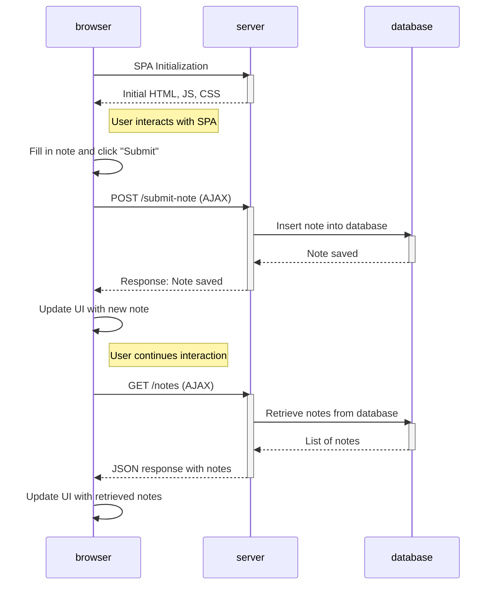

```mermaid
sequenceDiagram
    participant browser
    participant server
    participant database

    browser->>server: SPA Initialization
    activate server
    server-->>browser: Initial HTML, JS, CSS
    deactivate server

    Note right of browser: User interacts with SPA
    browser->>browser: Fill in note and click "Submit"

    browser->>server: POST /submit-note (AJAX)
    activate server
    server->>database: Insert note into database
    activate database
    database-->>server: Note saved
    deactivate database
    server-->>browser: Response: Note saved
    deactivate server

    browser->>browser: Update UI with new note

    Note right of browser: User continues interaction

    browser->>server: GET /notes (AJAX)
    activate server
    server->>database: Retrieve notes from database
    activate database
    database-->>server: List of notes
    deactivate database
    server-->>browser: JSON response with notes
    deactivate server

    browser->>browser: Update UI with retrieved notes

```